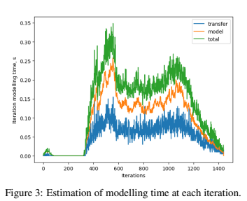
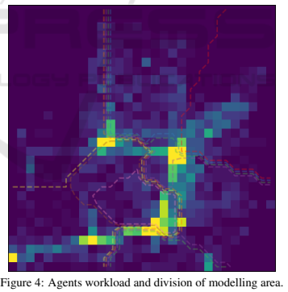

# IntModel
codesign intellectual scheduler.
The problem was to solve dynamic scheduling of distributed application for multi-agent modelling.
The project include:
 - Simulator of distributed infrastructure
 - Modelling of Urban mobility based on transport cards
 - GA based scheduling algorithm

The results were used in paper:
https://www.scitepress.org/Papers/2019/83656/83656.pdf

Density of workload

Example of an dynamic solution

